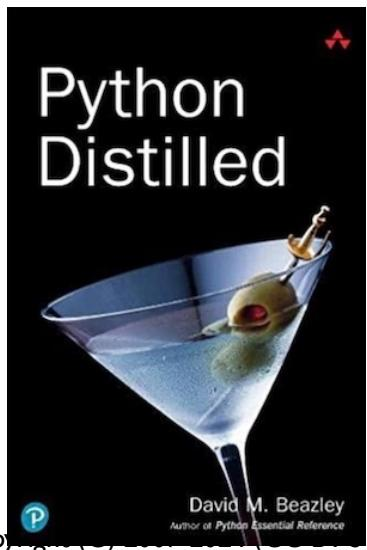
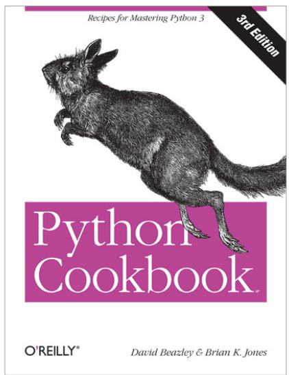
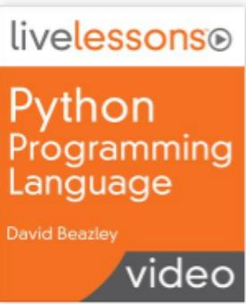

# Books/Video

Python Programming Language 50 reviews by David Beazley

https://www.safaribooksonline.com

# Course License and Usage

• Official course materials are here

https://github.com/dabeaz-course/python-mastery

This course is released under the Creative Commons Attribution-Share Alike 4.0 International (CC-SA 4.0) license.

You are free to use and adapt this material in any way that you wish as you as you give attribution to the original source. If you choose to use selected presentation slides in your own course, I kindly ask that the copyright notice, license, and authorship in the lower-left corner remain present.

# About This Course

Overheard:

"The power of Python grows according to the skill and experience of the person using it."

This course is about that!   
Going far beyond the tutorial   
Looking at things that you might care about if you're going to write "real" programs

# Target Audience

Programmers who are writing Python code that will be used by others (libraries, application frameworks, domain-specific languages, etc.)   
• Topics strongly focus on software development

• Proper usage of Python features   
Performance tradeoffs   
Design options

# System Requirements

• You should be using Python 3.6 or newer   
Try to use the latest version   
• You need a local development environment   
• Any operating system is fine

# Prerequisites

This course assumes that you have already been using Python in some manner   
Previously completed some kind of online tutorial, taken an introductory course, or just worked on some code yourself.   
You should know the basics of running the interpreter and writing programs

