# 섹션 0

# 과정 준비

# 필수 파일

• 파이썬 설치 (설치되어 있지 않은 경우)

http://www.python.org

• 본 과정은 파이썬 3.6 이상 버전을 기준으로 작성되었습니다.
• 실습 예제 저장소

github.com/dabeaz-course/python-mastery

• 시작하기 전에 먼저 위 저장소를 클론(Clone)하거나 포크(Fork)하세요.

# 작업 환경

• 이 과정은 입문자용 과정이 아닙니다.
• 파이썬 코드를 개발할 때 평소 사용하는 도구를 그대로 사용하세요. (에디터, IDE 등)
• 이 과정의 거의 모든 내용은 플랫폼 중립적이며 어디서든 작동합니다.

# 실습 예제

실습 설명은 다음 디렉토리에 있습니다.

python-mastery/Exercises/

• 모든 실습에는 모범 답안 코드가 포함되어 있습니다.

파일을 열고, 모든 줄을 읽고, 정수(int)로 변환하는 프로그램을 작성하세요. 문자열을 부동 소수점(float)으로 변환하려면 다음을 사용하세요.

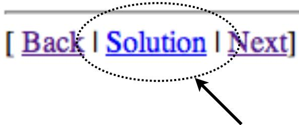

하단의 링크를 확인하세요!

# 실습 예제

• 작동하는 솔루션 코드는 다음에서 확인할 수 있습니다.

python-mastery/Solutions

• 각 문제별로 별도의 디렉토리가 구성되어 있습니다.

2_1/ (실습 2.1)
2_2/ (실습 2.2)

# 일반적인 팁

• 모든 작업 결과물은 "python-mastery" 폴더 안에 저장하세요.
• 실습 예제들은 이 폴더 구조를 가정하고 작성되었습니다.
• 실습은 순서대로 진행하는 것이 좋습니다.
• 진행하다 막히면 `Solutions/`에 있는 코드를 복사해서 시작한 뒤 다음 단계로 넘어가셔도 됩니다.

# 섹션 1

# 파이썬 복습

(선택 사항)

# 개요

• 파이썬의 핵심 내용을 매우 빠르게 훑어봅니다.
• 이 과정을 수강하기 위해 반드시 알고 있어야 하는 절대적인 기초 사항들입니다.
• 이후 수업 내용을 이해하는 데 필수적인 세부 사항들을 다룹니다.

# 파이썬의 모든 것

http://www.python.org

• 다운로드
• 문서 및 튜토리얼
• 커뮤니티 링크
• 뉴스 및 기타 정보

# 파이썬 실행하기

파이썬 프로그램은 인터프리터 안에서 실행됩니다.
인터프리터는 보통 커맨드 쉘(예: Unix 쉘)에서 시작하는 간단한 "콘솔 기반" 애플리케이션입니다.

```txt
bash % python3  
Python 3.6.0 (default, Jan 27 2017, 13:20:23)  
[GCC 4.2.1 Compatible Apple LLVM 6.1.0 (clang-602.0.53)]  
>>> 
```

# 대화형 모드 (Interactive Mode)

인터프리터는 "읽기-평가(read-eval)" 루프를 실행합니다.

```txt
>>> print('hello world')  
hello world  
>>> 37*42  
1554  
>>> for i in range(5):  
...     print(i)  
0  
1  
2  
3  
4  
>>> 
```

• 직접 입력한 간단한 문장들을 즉시 실행합니다.
• 디버깅과 탐색에 매우 유용합니다.

# 프로그램 만들기

프로그램 코드는 `.py` 파일에 작성합니다.

# helloworld.py
```python
print('hello world')
```

• 소스 파일은 일반 텍스트 파일입니다.
• 선호하는 에디터(예: emacs, VS Code 등)로 작성하세요.
• 반드시 "파이썬(python)" 모드를 사용하세요.

# 프로그램 실행하기

# 명령줄(Command line) 실행

```batch
bash % python3 helloworld.py  
hello world  
bash % 
```

# #! (Unix 쉐뱅)

```txt
#!/usr/bin/env python3
# helloworld.py
print('hello world') 
```

# 대화형 디버깅

• 디버깅을 위해 `python -i`를 사용하세요.

```txt
bash % python3 -i helloworld.py  
hello world  
>>> 
```

• 프로그램을 실행한 직후 파이썬 대화형 쉘로 진입합니다.
• 디버깅, 테스트 등에 매우 유용합니다.

# 실습

소요 시간: 10분

# 프로그램 실행 방식

• 파이썬 프로그램은 일련의 문장(statements)들로 구성됩니다.
• 각 문장은 줄바꿈으로 끝납니다.
• 문장들은 파일의 끝에 도달할 때까지 순차적으로 실행됩니다.
• 더 실행할 문장이 없으면 프로그램이 종료됩니다.

# 주석 (Comments)

주석은 `#`으로 시작합니다.

```python
# 이것은 주석입니다.
height = 442 # 단위: 미터
```

• 블록 주석(예: `/* ... */`)은 따로 없습니다.
• 하지만 문자열 안에 코드를 넣어 무시하게 만드는 트릭을 쓰기도 합니다.

```python
"""
이 안의 모든 코드는 무시됩니다.
for i in range(10):
    print("Hello", i)
"""
```

문자열 형태의 코드는 정식 주석은 아니지만, 디버깅할 때 유용한 트릭입니다.

# 변수 (Variables)

• 변수는 어떤 값에 붙이는 이름입니다.
• 변수 이름은 보통 C 언어의 규칙을 따릅니다: `[A-Za-z_][A-Za-z0-9_]*`
• 타입을 미리 선언하지 않습니다 (int, float 등).

```python
height = 442           # 정수
height = 442.0         # 부동 소수점
height = '정말 높음'    # 문자열
```

변수가 고정된 타입을 가져야 하는 C++/Java와는 다릅니다.

# 변수 이름에 대하여

변수 이름에는 사실 유니코드 문자와 숫자를 모두 사용할 수 있습니다.
따라서 다음과 같은 코드도 유효합니다.

$$ \pi = 3.14159 $$
$$ \tau = 2 * \pi $$

하지만 키보드로 입력하기 어렵거나 설명하기 복잡하다면 피하는 것이 좋습니다.

# 명명 규칙 (Naming Conventions)

• 여러 단어를 조합할 때는 "스네이크 케이스(snake case)"를 사용하세요.

```python
first_name = "Guido"  
last_name = "van Rossum" 
```

• 가급적 소문자를 사용하세요.
• "내부용(private)" 이름에는 앞에 `_`를 붙입니다.

```python
def _internal_function():
    ...
```

# 표현식 (Expressions)

• 수학 연산은 일반적인 규칙(우선순위, 결합 법칙 등)을 따릅니다.

$$ a = 2 + 3 $$
$$ b = 2 + 3 * 4 $$
$$ c = (2 + 3) * 4 $$

연산자는 C 언어와 거의 같습니다: `+, -, *, /, %, <, >, &, |, ^` 등

• 파이썬 전용 연산자:
- `7 // 4` : 버림 나눗셈 (결과: 1)
- `7 ** 4` : 거듭제곱 (7의 4승)

# 조건문

# If-else
```python
if a < b:
    print('컴퓨터가 아니라고 합니다')
else:
    print('컴퓨터가 맞다고 합니다')
```

# If-elif-else
```python
if a == '+':  
    op = PLUS  
elif a == '-':  
    op = MINUS  
elif a == '*':  
    op = TIMES  
else:  
    op = UNKNOWN 
```

# 관계 연산

관계 연산자: `<, >, <=, >=, ==, !=`

불리언(Boolean) 표현식: `and, or, not`

```python
if b >= a and b <= c:
    print('b는 a와 c 사이에 있습니다')

if not (b < a or b > c):
    print('b는 여전히 a와 c 사이에 있습니다')
```

# 반복문 (Looping)

• `while`문은 조건이 참인 동안 반복합니다.

```python
while count > 0:
    print('발사', count, '초 전')
    count -= 1
print('펑!')
```

• `for`문은 항목들을 순회합니다 (foreach 방식).

```python
nums = [1, 7, 10, 23]
for x in nums:
    print(x) # 1, 7, 10, 23 출력
```

# 반복 제어

- `break` : 루프를 즉시 종료합니다.
```python
for name in names:
    if name == 'python':
        break
```

- `continue` : 다음 반복으로 건너뜁니다.
```python
for line in lines:
    if line == '\n': # 빈 줄 무시
        continue
```

# 출력하기 (Printing)

`print()` 함수를 사용합니다.

```python
print(x)
print(x, y, z)
print('당신의 이름은', name, '입니다')
```

• 한 줄의 텍스트를 생성합니다.
• 각 항목은 공백으로 구분됩니다.

# 형식화된 출력 (Formatted Printing)

• f-문자열 (f-strings)
```python
print(f'{name:>10s} {shares:>10d} {price:>10.2f}')
```

• `.format()` 메서드
```python
print('{:10s} {:10d} {:10.2f}'.format(name, shares, price))
```

• `%` 연산자 사용 (C 스타일)
```python
print('%10s %10d %10.2f' % (name, shares, price))
```

# pass 문

가끔 빈 코드 블록을 명시해야 할 때가 있습니다.

```python
if name in namelist:
    # 아직 구현되지 않음 (또는 아무것도 하지 않음)
    pass
else:
    # 다른 문장들
    ...
```

`pass`는 아무것도 하지 않는 "무연산(no-op)" 문장입니다. 나중에 코드를 추가할 자리 표시자 역할을 합니다.

# 파이썬 핵심 객체

프로그램은 내장된 핵심 데이터 타입들로 구축됩니다.

```txt
None         # 아무것도 없음 (null)
True / False # 불리언
23           # 정수
2.3          # 부동 소수점
2+3j         # 복소수
'Hello'      # 문자열 (유니코드)
b'Hello'     # 바이트 문자열
('www.python.org', 80) # 튜플
[1, 2, 3, 4] # 리스트
{'name':'IBM', ...}    # 딕셔너리
```

파이썬을 조금이라도 다뤄보셨다면 대부분 이미 사용해 보셨을 것입니다.

# 객체 조작하기

• 연산자를 통한 조작

```txt
a + b      # 더하기
x = a[i]   # 인덱스 조회
y = a[i:j] # 슬라이싱
a[i] = val # 인덱스 할당
x in a     # 포함 여부 확인
...
```

• 다양한 메서드를 통한 조작

```python
a.find('python')
a.split(',')
b.append(2)
...
```

사용 가능한 연산자와 메서드는 조작하려는 객체의 타입에 따라 다릅니다.

# 실습 1.2

소요 시간: 15분

# 파일 입출력 (I/O)

# 파일 열기

- 읽기 모드: `f = open('foo.txt', 'r')`
- 쓰기 모드: `g = open('bar.txt', 'w')`
- 추가 모드: `h = open('log.txt', 'a')`

# 데이터 읽기

- 한 줄 읽기: `line = f.readline()`
- 데이터 읽기: `data = f.read([maxbytes])`

# 파일에 쓰기

`g.write('내용')`

# 파일 닫기 (완료 후)

`f.close()`

# 파일 닫기의 중요성

사용이 끝난 파일은 반드시 닫아야 합니다.

```python
f = open('foo.txt', 'r')
# f 사용
...
f.close() 
```

최신 파이썬에서는 `with` 문을 사용합니다 (권장).

```python
with open('foo.txt', 'r') as f:
    # f 사용
    ...
# 여기서 자동으로 닫힘
```

# 자주 쓰이는 패턴 (Idioms)

• 파일을 한 줄씩 읽기
```python
with open('foo.txt', 'r') as f:
    for line in f:
        # 줄 처리
```

• 파일 전체를 문자열로 읽기
```python
with open('foo.txt', 'r') as f:
    data = f.read()
```

• 파일에 쓰기
```python
with open('foo.txt', 'w') as f:
    f.write('내용\n')
```

# 텍스트 데이터

• 텍스트를 읽을 때 파이썬 3은 유니코드를 가정합니다.
• 인코딩을 지정해야 할 수도 있습니다.

$$ f = open('foo.txt', 'r', encoding='latin-1') $$

# 바이너리 데이터

바이너리 데이터를 다룰 때는 반드시 모드에 `b`를 붙이세요.

$$ f = open('foo.dat', 'rb') $$
$$ g = open('bar.bin', 'wb') $$

바이너리 모드 파일에서 읽거나 쓰는 데이터는 일반적인 8비트 문자열(bytes)입니다. 텍스트가 아닌 경우 출력할 수 없는 제어 문자나 널(null) 값 등이 포함될 수 있습니다.

# 실습 1.3

소요 시간: 10분

# 간단한 함수

• 재사용하고 싶은 코드에는 함수를 사용하세요.

```python
def sumcount(n):
    total = 0
    while n > 0:
        total += n
        n -= 1
    return total 
```

함수 호출:
```python
a = sumcount(100) 
```

• 함수는 어떤 작업을 수행하고 결과를 반환하는 일련의 문장들입니다.

# 함수의 특징

• 함수는 합리적으로 동작합니다.
- 내부 변수는 로컬 스코프(범위)를 가집니다.
- 재귀 호출도 잘 작동합니다.
- 기본 인자(default arguments)를 설정할 수 있습니다.

함수에 대해서는 나중에 더 자세히 다루겠지만, 기본적인 정의와 사용법은 이미 알고 계셔야 합니다.

# 예외 처리 (Exception Handling)

에러는 예외(exception)로 보고됩니다.
• 예외가 발생하면 프로그램이 중단됩니다.

```txt
>>> int('N/A')
Traceback (most recent call last):
    File "<stdin>", line 1, in <module>
ValueError: invalid literal for int() with base 10: 'N/A'
>>> 
```

메시지에는 무슨 일이 일어났는지, 어디서 에러가 발생했는지, 그리고 트레이스백(traceback) 정보가 포함되어 있어 디버깅에 도움을 줍니다.

# 예외 잡기

예외는 가로채서 처리할 수 있습니다.
• `try-except` 문을 사용합니다.

```python
for line in f:
    fields = line.split()
    try:
        shares = int(fields[1])
    except ValueError:
        print("파싱 실패:", line)
```

`except` 뒤의 이름은 잡으려는 에러의 종류와 일치해야 합니다.

# 예외 발생시키기

• 예외를 직접 발생시키려면 `raise` 문을 사용합니다.

```python
raise RuntimeError('문제가 발생했습니다!')
```

• 잡지 않으면 프로그램은 예외 트레이스백을 출력하며 종료됩니다.

# 예외 값

• 대부분의 예외는 관련 값을 가지고 있습니다. (무엇이 잘못되었는지에 대한 추가 정보)
- `raise RuntimeError('잘못된 사용자 이름')`
- `except` 문에서 변수에 할당할 수 있습니다.

```python
try:
    ...
except RuntimeError as e:
    print('실패 사유:', e)
```

# 여러 에러 처리하기

다양한 종류의 예외를 따로 잡을 수 있습니다.

```python
try:
    ...
except ValueError as e:
    ...
except TypeError as e:
    ...
```

• 처리 방식이 같다면 하나로 묶을 수 있습니다.

```python
try:
    ...
except (ValueError, TypeError) as e:
    ...
```

• 모든 예외 잡기 (위험할 수 있으니 주의하세요)

```python
try:
    ...
except Exception as e:
    ...
```

# finally 문

예외 발생 여부와 상관없이 반드시 실행되어야 하는 코드를 지정합니다.

```python
lock = Lock()
lock.acquire()
try:
    ...
finally:
    lock.release()  # 반드시 락을 해제함
```

리소스 관리(특히 락, 파일 등)를 적절히 하기 위해 자주 사용됩니다.

# 실습 1.4

소요 시간: 10분

# 객체 (Objects)

파이썬은 객체 지향 언어입니다.
모든 기본 데이터 타입(정수, 문자열, 리스트 등)은 "객체"의 예시입니다.
객체는 데이터와 그 데이터를 조작하는 "메서드"들의 집합으로 이루어집니다.

```python
a = 'Hello World'  # 문자열 객체
b = a.upper()      # 문자열에 적용된 메서드
items = [1, 2, 3]  # 리스트 객체
items.append(4)    # 리스트에 적용된 메서드
```

# 클래스 (Classes)

• 직접 객체를 만들 수 있습니다.

```python
class Player:
    def __init__(self, x, y):
        self.x = x
        self.y = y
        self.health = 100 

    def move(self, dx, dy):
        self.x += dx
        self.y += dy 

    def damage(self, pts):
        self.health -= pts
```

클래스란 무엇일까요? 다양한 메서드를 구현하는 함수 정의들의 모음입니다.

# 인스턴스 (Instances)

클래스를 함수처럼 호출하여 생성합니다.

```python
>>> a = Player(2, 3)
>>> b = Player(10, 20)
```

각 인스턴스는 자신만의 데이터를 가집니다.

```python
>>> a.x
2   
>>> b.x
10   
```

• 메서드는 다음과 같이 호출합니다.

```python
>>> a.move(1, 2)  
>>> a.damage(10)  
```

# __init__ 메서드

• 새로운 인스턴스를 초기화하는 메서드입니다.
• 새로운 객체가 생성될 때마다 호출됩니다.

```python
class Player:  
    def __init__(self, x, y):  
        self.x = x  
        self.y = y  
        self.health = 100  
```

• 주로 데이터 속성(attributes)을 저장하는 역할을 합니다.

# 메서드 (Methods)

• 인스턴스에 작용하는 함수입니다.

```python
class Player:
    def move(self, dx, dy):
        self.x += dx
        self.y += dy 
```

• 객체 자신이 첫 번째 인자로 전달됩니다.

```python
>>> a.move(1, 2)
# 내부적으로는 move(a, 1, 2)와 같이 동작함
```

• 관례상 이 인스턴스를 `self`라고 부릅니다. 이름 자체는 중요하지 않지만(첫 번째 인자로 객체가 전달된다는 점이 중요), 파이썬 스타일 가이드에서는 `self`를 사용할 것을 권장합니다. C++의 `this` 포인터와 비슷합니다.

# 실습 1.5

소요 시간: 10분

# 모듈 (Modules)

• 모든 파이썬 소스 파일은 모듈입니다.

```python
# foo.py
def grok(a): ...
def spam(b): ...
```

• `import` 문은 모듈을 로드하고 실행합니다.

```python
import foo  
a = foo.grok(2)  
b = foo.spam('Hello')  
```

# 네임스페이스 (Namespaces)

• 모듈은 이름이 붙은 값들의 집합입니다 (즉, "네임스페이스"라고 합니다).
이 이름들은 단순히 소스 파일에 정의된 모든 전역 변수와 함수들입니다.
• 임포트 후에는 모듈 이름을 접두사로 사용합니다.

```python
>>> import foo  
>>> foo.grok(2)
```

• 모듈 이름은 소스 파일 이름과 연결됩니다 (foo -> foo.py).

# 전역(Globals) 다시 보기

"전역" 스코프에 정의된 모든 것이 모듈 네임스페이스를 채웁니다.

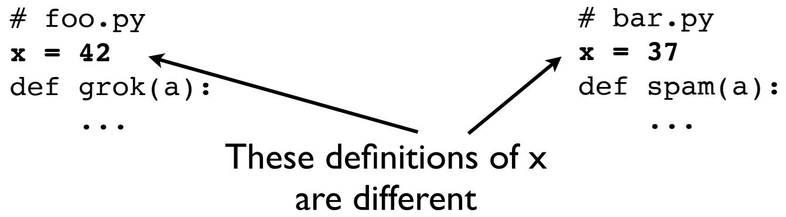

서로 다른 모듈은 같은 이름을 사용할 수 있으며, 이 이름들은 서로 충돌하지 않습니다 (모듈은 격리되어 있습니다).

# import as 문

• 모듈의 로컬 이름을 변경합니다.

```python
# bar.py
import math as m
a = m.sin(x)
```

`import`와 똑같이 동작하지만, 모듈 객체에 다른 이름을 할당할 뿐입니다. 이 새 이름은 임포트를 수행한 소스 파일 내에서만 유효합니다.

# from module import

모듈에서 선택한 심볼들만 현재 로컬 스코프로 가져옵니다.

```python
# bar.py
from math import sin, cos

def rectangular(r, theta):
    x = r * cos(theta)
    y = r * sin(theta)
    return x, y
```

모듈 접두사를 붙이지 않고도 모듈의 일부를 사용할 수 있게 해줍니다.

# from module import *

모듈의 모든 심볼을 로컬 스코프로 가져옵니다.

```python
# bar.py
from math import * 
```

모듈의 많은 함수를 사용할 때 접두사를 계속 붙이는 것이 번거로울 경우 유용할 수 있습니다.

# 주의: from module import *

실무에서는 가급적 사용하지 마세요. 코드 가독성을 떨어뜨리기 때문입니다.
예시:
```python
from math import * 
from random import *

r = gauss(0.0, 1.0) # 어느 모듈의 함수일까요?
```
라이브러리 함수의 원래 정의를 찾기 매우 어렵게 만듭니다.

# 메인 모듈 (Main Module)

파이썬에는 따로 "main" 함수나 메서드가 없습니다.
대신 "main" 모듈이 존재합니다.
• 단순히 가장 먼저 실행되는 소스 파일을 말합니다.

```bash
bash % python3 foo.py
```

인터프리터 시작 시점에 전달한 모듈이 "main"이 됩니다.

# 메인 체크 (main check)

메인 프로그램으로 실행될 수 있는 모듈들은 보통 다음과 같은 관례를 따릅니다.

```python
# foo.py
if __name__ == '__main__':
    # 메인 프로그램으로 실행될 때만 수행될 문장들
    ...
```

`if` 문 안에 있는 코드들이 "메인" 프로그램이 됩니다.

# 모듈 찾기

모듈은 특별한 모듈 검색 경로(`sys.path`)에 있는 디렉토리에서 로드됩니다.

```python
>>> import sys   
>>> sys.path   
['', '/usr/local/lib/python3.6', ...]
```

대부분의 `ImportError`는 경로 문제나 파일 이름 문제 때문에 발생합니다.

# 모듈 검색 경로

`sys.path`에 검색 경로가 들어있습니다.
• 필요하다면 직접 수정할 수 있습니다.

```python
import sys
sys.path.append('/project/foo/pyfiles')
```

환경 변수를 통해서도 경로를 추가할 수 있습니다.

```bash
% env PYTHONPATH=/project/foo/pyfiles python3
```

# 요약

• 지금까지 기초적인 내용을 훑어보았습니다.
• 이미 파이썬 프로그래밍을 해오셨다면 알고 계셔야 할 내용들입니다.
• 이후 섹션에서는 훨씬 더 깊이 있게 다룰 예정입니다.

# 실습 1.6

소요 시간: 5분

# 섹션 2

# 데이터 처리 (Data Handling)

# 핵심 주제

• 자료구조
• 컨테이너와 컬렉션
• 반복(Iteration)
• 내장 객체(Builtins)의 이해
• 객체 모델

# 자료구조 (Data Structures)

• 실제 프로그램은 복잡한 데이터를 다뤄야 합니다.
예시: 주식 보유 현황
- GOOG 주식 100주, 가격 $490.10

• 세 부분으로 이루어진 "객체"
- 이름 ("GOOG", 문자열)
- 주식 수 (100, 정수)
- 가격 (490.10, 부동 소수점)

# 자료구조 구성 옵션

• 튜플 (Tuple)
• 딕셔너리 (Dictionary)
• 클래스 인스턴스 (Class instance)

이제 각 방식을 짧게 살펴보겠습니다.

# 튜플 (Tuples)

• 여러 값을 하나로 묶은 컬렉션입니다.

$$ s = ('GOOG', 100, 490.1) $$

배열처럼 사용할 수 있습니다.

$$ name = s[0] $$
$$ cost = s[1] * s[2] $$

• 별개의 변수로 언패킹(Unpacking)하기:

$$ name, shares, price = s $$

불변성 (Immutable):

$$ s[1] = 75 \quad \# TypeError 발생. 항목 할당 불가. $$

# 딕셔너리 (Dictionaries)

• "키(key)"로 인덱싱되는 순서 없는 값들의 집합입니다.

```python
s = {
    'name' : 'GOOG',
    'shares' : 100,
    'price' : 490.1
} 
```

• 키 이름을 사용하여 접근합니다.

```python
name = s['name']
cost = s['shares'] * s['price'] 
```

수정이 가능합니다.

```python
s['shares'] = 75  
s['date'] = '7/25/2015'  
del s['name'] 
```

# 사용자 정의 클래스

# • 간단한 자료구조 클래스

```python
class Stock:
    def __init__(self, name, shares, price):
        self.name = name
        self.shares = shares
        self.price = price 
```

# • 깔끔한 객체 문법을 사용할 수 있습니다.

```python
>>> s = Stock('GOOG', 100, 490.1)   
>>> s.name   
'GOOG'   
>>> s.shares * s.price   
49010.0   
```

# 클래스의 변형

• 클래스 정의에는 몇 가지 변형이 있습니다.

- 슬롯(Slots) - 메모리 절약
- 데이터 클래스(Dataclasses) - 코드 양 감소
- 네임드 튜플(Named tuples) - 불변성/튜플 특징 유지

하나씩 살펴보겠습니다.

# 클래스와 슬롯 (__slots__)

• 자료구조용 클래스라면 `__slots__` 추가를 고려해 보세요.

```python
class Stock:
    __slots__ = ('name', 'shares', 'price')
    def __init__(self, name, shares, price):
        self.name = name
        self.shares = shares
        self.price = price 
```

`__slots__`는 자료구조를 위해 특별히 설계된 성능 최적화 도구입니다.
• 메모리 사용량을 크게 줄여줍니다.

# 데이터 클래스 (Dataclasses)

```python
from dataclasses import dataclass

@dataclass
class Stock:
    name: str
    shares: int
    price: float
```

• 작성해야 할 코드의 양을 줄여주는 편리한 도구입니다.
• 유용한 메서드들이 자동으로 생성됩니다.
• 하지만 타입이 강제되지는 않습니다 (단순 힌트일 뿐).

# 네임드 튜플 (Named Tuples)

• 클래스 정의의 또 다른 변형입니다.

```python
import typing
class Stock(typing.NamedTuple):
    name: str
    shares: int
    price: float
```

• 다른 방식 (오래된 코드에서 자주 보임):
```python
from collections import namedtuple
Stock = namedtuple('Stock', ['name', 'shares', 'price'])
```
주요 특징: 불변성(Immutability)

# 네임드 튜플의 특징

네임드 튜플은 튜플과 같은 특징(불변성, 언패킹, 인덱싱 등)을 가집니다.

```python
>>> s = Stock('GOOG', 100, 490.1)   
>>> s[0]
'GOOG'   
>>> name, shares, price = s   
>>> print('%10s %10d %10.2f' % s)
      GOOG        100     490.10   
>>> isinstance(s, tuple)   
True   
>>> s.name = 'ACME'   
# AttributeError 발생: 속성을 설정할 수 없음
```

# 실습 2.1

소요 시간: 30분

# 컨테이너 (Containers)

• 프로그램은 종종 많은 객체를 다뤄야 합니다.

- 리스트 (순서가 있는 데이터)
- 셋 (순서가 없고 중복이 없는 데이터)
- 딕셔너리 (순서가 없는 키-값 데이터)

• 문제의 성격에 따라 적절한 것을 선택하세요.

# 리스트 (Lists)

• 데이터의 순서가 중요할 때 사용하세요.
예시: 튜플들의 리스트

```python
portfolio = [
    ('GOOG', 100, 490.1),
    ('IBM', 50, 91.1),
    ('CAT', 150, 83.44)
] 
```

• 리스트는 정렬하거나 순서를 바꿀 수 있습니다.

# 셋 (Sets)

• 중복되지 않는 고유한 항목들의 순서 없는 컬렉션입니다.

$$ a = {'IBM', 'AA', 'AAPL'} $$

중복을 제거합니다.

```python
names = ['IBM', 'YHOO', 'IBM', 'CAT', 'MSFT', 'CAT', 'IBM']
unique_names = set(names)
```

멤버십 테스트(포함 여부 확인)에 유용합니다.

```python
members = set()
members.add(item)    # 항목 추가
members.remove(item) # 항목 삭제

if item in members:  # 포함 여부 확인
    ...
```

# 딕셔너리 (Dicts)

• 인덱스나 조회용 테이블로 유용합니다.

```python
prices = {
    'GOOG' : 513.25,
    'CAT'  : 87.22,
    'IBM'  : 93.37,
    'MSFT' : 44.12
}
```

일반적인 용법:

```python
p = prices['IBM']              # 값 조회
p = prices.get('AAPL', 0.0)    # 기본값을 포함한 조회
prices['HPE'] = 37.42          # 할당
if name in prices:             # 멤버십 테스트 
```

# 딕셔너리, 복합 키 (Composite Keys)

# • 여러 부분으로 된 키에는 튜플을 사용하세요.

```python
prices = {
    ('ACME', '2017-01-01') : 513.25,
    ('ACME', '2017-01-02') : 512.10,
    ('ACME', '2017-01-03') : 512.85,
    ('SPAM', '2017-01-01') : 42.1,
    ('SPAM', '2017-01-02') : 42.34,
    ('SPAM', '2017-01-03') : 42.87,
}
```

# 사용법:

```python
p = prices['ACME', '2017-01-01']
prices['ACME', '2017-01-04'] = 515.20 
```

# 컴프리헨션 (Comprehensions)

- 리스트 컴프리헨션: `[ 표현식 for 항목 in 시퀀스 if 조건 ]`
- 셋 컴프리헨션: `{ 표현식 for 항목 in 시퀀스 if 조건 }`
- 딕셔너리 컴프리헨션: `{ 키:값 for 항목 in 시퀀스 if 조건 }`

기존 데이터로부터 리스트, 셋, 딕셔너리를 간단하게 생성할 수 있습니다.

# 컴프리헨션 구조

일반적인 문법: `[표현식 for 항목 in 시퀀스 if 조건]`

작동 원리:
```python
result = []   
for item in sequence:
    if condition:
        result.append(expression)
```
셋과 딕셔너리 컴프리헨션도 비슷합니다.

# 컴프리헨션 예시

데이터에서 값 추출:
`names = [s['name'] for s in portfolio]`

고유 값 추출:
`unique_names = {s['name'] for s in portfolio}`

데이터베이스 같은 쿼리 수행:
`results = [s for s in portfolio if s['price'] > 100 and s['shares'] > 50 ]`

• 시퀀스에 대한 빠른 수학 연산:
`cost = sum([s['shares'] * s['price'] for s in portfolio])`

# collections 모듈

특수한 문제를 해결하기 위해 일반적인 자료구조의 변형들을 제공합니다.

- `defaultdict`
- `Counter`
- `deque`
- 그 외 다수

# defaultdict

# • 누락된 딕셔너리 키를 자동으로 초기화합니다.

```python
from collections import defaultdict

>>> d = defaultdict(list)   
>>> d['x']   
[]   
>>> d
defaultdict(<class 'list'>, {'x': []})   
```

# • 복합 연산을 가능하게 합니다.

```python
>>> d['y'].append(42)   
>>> d['y']   
[42]   
```

# Counter

• 항목들의 개수를 세는 데 특화된 딕셔너리입니다.

```python
from collections import Counter

>>> totals = Counter()   
>>> totals['IBM'] += 20   
>>> totals['AA'] += 50   
>>> totals['ACME'] += 75   
>>> totals
Counter({'ACME': 75, 'AA': 50, 'IBM': 20})
```

• 순위 매기기 같은 편리한 기능을 제공합니다.
```python
>>> totals.most_common(2)
[('ACME', 75), ('AA', 50)]
```

# deque (데크)

# 양방향 큐 (Double-ended queue)

```python
from collections import deque

>>> q = deque()   
>>> q.append(1)   
>>> q.appendleft(3)   
>>> q
deque([3, 1])  
>>> q.pop()   
1   
>>> q.popleft()  
3   
```

• 큐 문제에서 리스트보다 효율적입니다.

# 이력 관리 (Keeping a History)

• 문제: 최근 N개의 이력을 유지하기

```python
history = deque(maxlen=N)
with open(filename) as f:
    for line in f:
        history.append(line)
```

# 다중 검색 (Multi-Search)

# 문제: 여러 곳을 동시에 검색하기

```python
techs = { 'IBM':91.23, 'AAPL':123.45, ... }
auto = { 'GM':23.45, 'TM':87.20, ... }
```

# 해결책: ChainMap

```python
from collections import ChainMap
allprices = ChainMap(techs, auto)

>>> allprices['IBM']
91.23
```

# 코멘트

• `collections` 모듈은 꼭 알아두어야 할 유용한 모듈입니다.
• 많은 공통적인 데이터 처리 문제를 단순화해 줍니다.
• 이걸 안 쓰고 있다면 손해 보는 겁니다.

# 실습 2.2

소요 시간: 45분

# 반복 (Iteration)

`for` 루프는 시퀀스를 순회합니다.

```python
>>> names = ['IBM', 'YHOO', 'AA', 'CAT']   
>>> for name in names:
        print(name)   
IBM   
YHOO   
...
```

단순해 보이지만 생각보다 강력합니다.

# 튜플 순회하기

# 튜플들의 리스트를 가정해 봅시다.

```python
portfolio = [
    ('GOOG', 100, 490.1),
    ('IBM', 50, 91.1),
    ...
]
```

# 언패킹과 함께 순회하기

```python
for name, shares, price in portfolio:
    ...
```

# 특정 값을 무시하며 순회하기 ( _ 사용)

```python
for name, _, price in portfolio:
    ...
```

# 다양한 형태의 레코드 순회

• 크기가 다른 자료구조들이 섞여 있는 경우:

```python
prices = [
    ['GOOG', 490.1, 485.25, 487.5],
    ['IBM', 91.5],
    ['HPE', 13.75, 12.1, 13.25, 14.2, 13.5],
]
```

• 와일드카드 언패킹 (파이썬 3 전용)

```python
for name, *values in prices:
    print(name, values)
```

# zip() 함수

여러 시퀀스를 병렬로 순회합니다.

```python
columns = ['name', 'shares', 'price']
values = ['GOOG', 100, 490.1]

for colname, val in zip(columns, values):
    # colname='name', val='GOOG' 로 시작
```

자주 쓰이는 용도: 딕셔너리 만들기
`record = dict(zip(columns, values))`

주의: 입력 중 가장 짧은 길이에 맞춰서 잘립니다.

# 카운트 유지하며 순회하기

`enumerate(sequence [, start])`

```python
names = ['IBM', 'YHOO', 'CAT']  
for n, name in enumerate(names):  
    # n=0 name='IBM' 으로 시작
```

예시: 파일 읽을 때 줄 번호 추적
```python
with open(filename) as f:
    for lineno, line in enumerate(f, start=1):
        ...
```

# 정수 범위 순회하기

`range([start,] end [,step])`

```python
for i in range(100):      # 0, 1, ..., 99
for j in range(10, 20):   # 10, 11, ..., 19
for k in range(10, 50, 2):# 10, 12, ..., 48
```

• 참고: 종료 값은 결과에 포함되지 않습니다.
주의: `range()`는 종종 "더 쉬운 방법"이 있는데도 어렵게 풀고 있다는 신호(Code Smell)일 수 있습니다.

# 시퀀스 리덕션 (Reductions)

`sum(s), min(s), max(s)`

불리언 테스트: `any(s), all(s)`

```python
>>> s = [False, True, True, False]
>>> any(s)
True
>>> all(s)
False
```

# 이터러블 언패킹 (Unpacking Iterables)

이런 이터러블들이 있을 때:

$$ a = (1, 2, 3) $$
$$ b = [4, 5] $$

• 리스트나 튜플 합치기 (파이썬 3.5+)

$$ c = [*a, *b] \quad \# [1, 2, 3, 4, 5] $$
$$ d = (*a, *b) \quad \# (1, 2, 3, 4, 5) $$

• `+`를 사용하는 것보다 유연할 수 있습니다. (서로 다른 타입을 합칠 때 에러가 나지 않음)

# 딕셔너리 언패킹

이런 딕셔너리들이 있을 때:

```python
a = {'name': 'GOOG', 'shares': 100}  
b = {'date': '6/11/2007', 'time': '9:45am'} 
```

# • 하나의 딕셔너리로 합치기 (파이썬 3.5+)

```python
c = {**a, **b}
```

# 인자 전달 (Argument Passing)

이터러블은 위치 인자(positional args)로 확장될 수 있습니다.

$$ a = (1, 2, 3) $$
`func(*a)` 는 `func(1, 2, 3)`과 같습니다.

• 딕셔너리는 키워드 인자(keyword args)로 확장됩니다.

$$ c = {'x': 1, 'y': 2} $$
`func(**c)` 는 `func(x=1, y=2)`와 같습니다.

# 제너레이터 표현식 (Generator Expressions)

• 반복을 통해 결과를 하나씩 생성하는 리스트 컴프리헨션의 변형입니다.
• 문법이 약간 다릅니다 (괄호를 사용).

$$ nums = [1, 2, 3, 4] $$
$$ squares = (x * x for x in nums) $$

• 반복을 통해 결과를 가져옵니다.
```python
for n in squares:
    ...
```

# 제너레이터의 특징

• 제너레이터는 **단 한 번만** 소비될 수 있습니다.

```python
>>> squares = (x*x for x in [1, 2])
>>> for n in squares: print(n)
1
4
>>> for n in squares: print(n)
(출력 없음 - 이미 다 소비됨)
```

# 제너레이터 사용하기

제너레이터는 결과가 중간 단계인 경우에 매우 유용합니다.
• 예시:

```python
def sumsquares(nums):
    squares = (x * x for x in nums)
    total = sum(squares)
    return total 
```

`squares`는 임시 값일 뿐이므로 리스트를 따로 만들 필요가 없습니다.

# 함수 인자로 제너레이터 전달

제너레이터 표현식은 종종 함수의 인자로 바로 전달됩니다.

```python
sum(x * x for x in nums)
print(','.join(str(x) for x in items))
```

• 이터러블에 대한 필터/변환기 역할을 합니다.


# 제너레이터 함수

• 반복을 지원하는 함수입니다.

```python
def squares(nums):
    for x in nums:
        yield x * x # 값을 내보냄
```

이 방식은 반복 처리가 더 복잡할 때 사용할 수 있는 좀 더 일반적인 형태입니다.

# 실습 2.3

소요 시간: 10분

# 내장 객체(Builtins)의 비밀

프로그래머들은 내장 타입을 별생각 없이 사용합니다.
하지만 더 나은 코드를 작성하기 위해 알아두어야 할 미묘한 동작들이 있습니다.

# 내장 객체란 무엇일까요?

• 파이썬 인터프리터의 일부인 객체입니다.
• 보통 완전히 C 언어로 구현되어 있습니다.
어떤 의미에서는 프로그램에서 사용할 수 있는 가장 원초적인(primitive) 종류의 객체입니다.

# 내부 구조 (Under the Hood)

• 모든 객체는 ID, 클래스(Class), 참조 횟수(Reference count)를 가집니다.

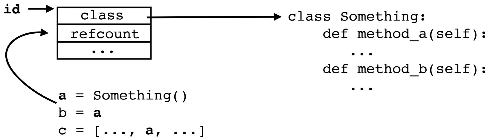

• ID는 메모리 주소입니다.
• 클래스는 "타입"입니다.
• 참조 횟수는 가비지 컬렉션(Garbage Collection)에 사용됩니다.

# 내장 객체 표현 방식

• **None** (싱글톤): 16바이트
• **float** (64비트 배정밀도): 24바이트
• **int** (임의 정밀도): 28바이트 이상 (30비트 단위로 저장)

# 문자열 표현 방식

문자열은 유니코드에 맞게 적응하며 크기가 달라집니다.

```python
>>> import sys
>>> sys.getsizeof('n')
50
>>> sys.getsizeof('til')
74
```

# 메모리 오버헤드

• 파이썬 객체에는 고유한 메모리 오버헤드가 있습니다.
• `sys.getsizeof()`로 확인할 수 있습니다.

```python
>>> sys.getsizeof(2)
28
>>> sys.getsizeof(2.5)
24
>>> sys.getsizeof('2.5')
52
```

# 내장 객체의 작동 원리

내장 타입들은 미리 정의된 "프로토콜(protocols)" (특수 메서드)에 따라 작동합니다.

```python
>>> a = 2 + 3
>>> a.__add__(3) # 프로토콜
```

# 객체 프로토콜

객체 프로토콜은 바이트 코드 수준에서 인터프리터에 매우 깊게 박혀 있습니다.

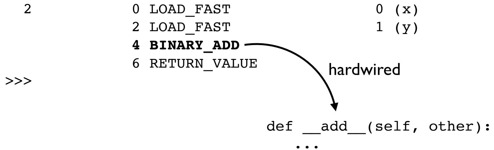

# 새로운 "내장 객체" 만들기

프로토콜을 잘 알면 내장 객체처럼 동작하는 새로운 객체를 만들 수 있습니다.
예시: `decimal`, `fractions`

# 실습 2.4

소요 시간: 30분

# 컨테이너 표현 방식

• 컨테이너 객체는 저장된 값에 대한 **참조(포인터)**만 가지고 있습니다.

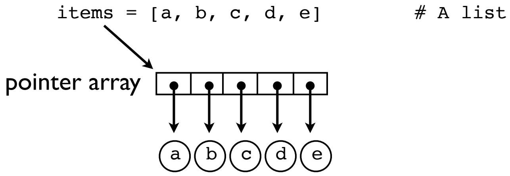

• 컨테이너 내부의 모든 작업은 객체 자체가 아니라 포인터만 조작합니다.

# 초과 할당 (Over-allocation)

• 가변(mutable) 컨테이너(리스트, 딕셔너리, 셋)는 항상 여유 슬롯이 있도록 메모리를 초과 할당합니다.

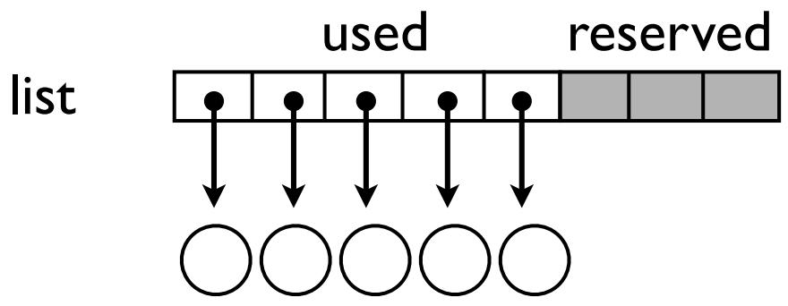

• 이는 성능 최적화를 위한 것입니다 (추가/삽입을 빠르게 하기 위함).

# 예시: 리스트 메모리

추가 공간 덕분에 대부분의 `append()` 작업은 매우 빠르게 수행됩니다 (새 메모리 할당 없이 이미 있는 공간을 사용).

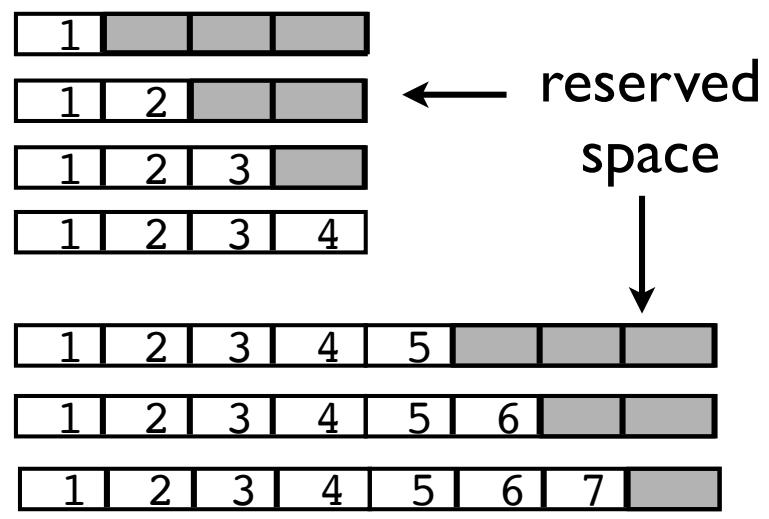

# 컨테이너의 성장

메모리 사용량은 저장된 값의 수에 비례하여 증가합니다.
- 리스트: 가득 차면 약 12.5% 증가
- 셋: 2/3가 차면 4배 증가
- 딕셔너리: 2/3가 차면 2배 증가

# 셋/딕셔너리 해싱 (Hashing)

• 키를 사용하여 정수 "해시 값"을 결정합니다 (`__hash__()` 메서드).
• 이 값은 내부 구현 상세로 사용됩니다.

# 키 제한 사항

• 셋과 딕셔너리의 키는 반드시 "해시 가능(hashable)"한 객체여야 합니다.
보통 문자열, 숫자, 튜플만 사용할 수 있습니다 (리스트, 딕셔너리 등은 불가).
• `__hash__()`와 `__eq__()` 메서드가 필요합니다.

# 딕셔너리 레이아웃

해싱의 요약: 해시 인덱스가 엔트리 위치를 가집니다.

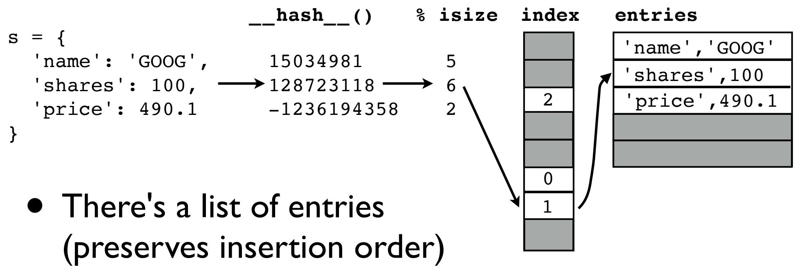

# 충돌 해결 (Collision Resolution)

• 빈 슬롯을 찾을 때까지 해시 인덱스를 변형(perturb)합니다.

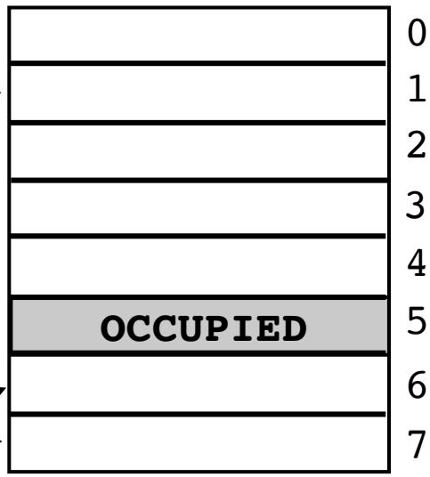

여유 슬롯이 많을수록 더 잘 작동합니다.

# 컨테이너 프로토콜

• 컨테이너 역시 "프로토콜"을 통해 작동합니다.
`__getitem__`, `__contains__` 등의 메서드를 구현하여 커스텀 컨테이너를 만들 수 있습니다.

# 컨테이너 분류 (Taxonomy)

새로운 컨테이너를 만들 때는 `collections.abc`를 참고하세요.
`Mapping`, `Sequence`, `Set` 등을 베이스 클래스로 사용하면 필요한 메서드 구현을 강제할 수 있습니다.

# 실습 2.5

소요 시간: 25분

# 할당(Assignment)의 이해

파이썬의 많은 작업은 값을 "할당"하거나 "저장"하는 것과 관련이 있습니다.

- 변수 할당: `a = value`
- 리스트 할당: `s[n] = value`
- 리스트 추가: `s.append(value)`
- 딕셔너리 추가: `d['key'] = value`

• **주의:** 할당 연산은 절대로 값을 **복사하지 않습니다.**
• 모든 할당은 단순히 참조(reference) 복사, 즉 포인터 복사입니다.

# 할당 예시

```python
a = [1, 2, 3]
b = a
c = [a, b]
```

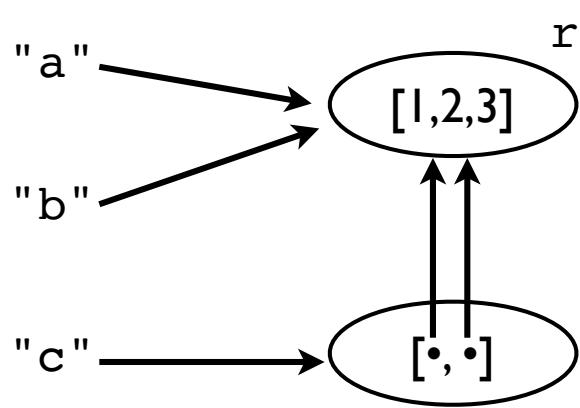

리스트 객체 `[1, 2, 3]`은 하나뿐이지만, 그것을 가리키는 참조는 4개입니다.

# 할당 주의 사항

값을 수정하면 모든 참조에 영향을 줍니다.

```python
>>> a.append(999)
>>> b
[1, 2, 3, 999]
>>> c
[[1, 2, 3, 999], [1, 2, 3, 999]]
```

복사가 이루어진 적이 없으므로, 모든 이름이 같은 객체를 가리키고 있기 때문에 발생하는 현상입니다.

# 객체에 의한 호출 (Call by Object)

• 함수 호출 시 객체는 복사되지 않습니다.

```python
def func(items):
    items.append(42)

>>> a = [1, 2, 3]
>>> func(a)
>>> a
[1, 2, 3, 42]
```

• 가변 객체를 수정하면 원본에 영향을 줍니다. (불변 객체는 상관없음)

# 이름 재할당 (Reassigning Names)

• 이름을 재할당한다고 해서 이전 값의 메모리를 덮어쓰는 것은 아닙니다.

```python
a = [1, 2, 3]
b = a
a = [4, 5, 6]
```

이제 `a`는 다른 객체를 가리키게 되고, `b`는 여전히 원래 객체를 가리킵니다.

# 정체성(Identity)과 참조

• 두 값이 메모리상에서 정확히 같은 객체인지 확인하려면 `is` 연산자를 사용하세요.

```python
>>> a = [1, 2, 3]
>>> b = a
>>> a is b
True
```

• 모든 객체는 정수 식별자(`id`)를 가집니다. 일종의 포인터 값이라고 생각하면 됩니다.

# 불변성(Immutability) 활용하기

불변 값은 안전하게 공유될 수 있습니다.

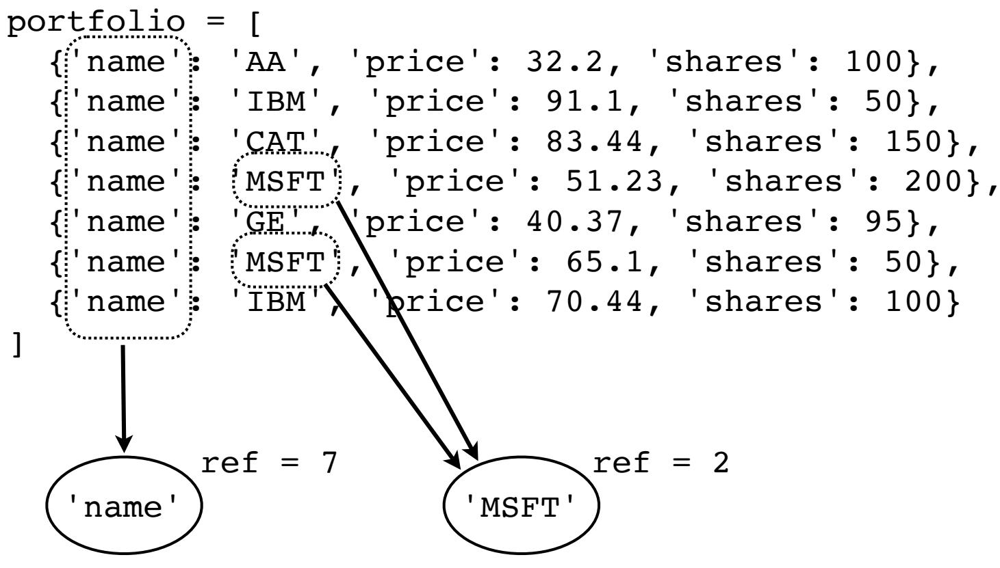
